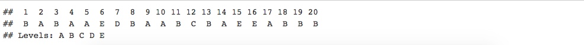

```{r setup, include=FALSE}
knitr::opts_chunk$set(echo = TRUE)
```

## Background
Using devices such as Jawbone Up, Nike FuelBand, and Fitbit it is now possible to collect a large amount of data about personal activity relatively inexpensively. These type of devices are part of the quantified self movement – a group of enthusiasts who take measurements about themselves regularly to improve their health, to find patterns in their behavior, or because they are tech geeks. One thing that people regularly do is quantify how much of a particular activity they do, but they rarely quantify how well they do it. The goal of the project is to use data from accelerometers on the belt, forearm, arm, and dumbell of 6 participants. They were asked to perform barbell lifts correctly and incorrectly in 5 different ways. More information is available from the website here: http://web.archive.org/web/20161224072740/http:/groupware.les.inf.puc-rio.br/har (see the section on the Weight Lifting Exercise Dataset).

## Data
The training data for this project are available here:
https://d396qusza40orc.cloudfront.net/predmachlearn/pml-training.csv

The test data are available here:
https://d396qusza40orc.cloudfront.net/predmachlearn/pml-testing.csv

1. Download the data set
```{r}
library(RCurl)

train_data= read.csv(text=getURL("https://d396qusza40orc.cloudfront.net/predmachlearn/pml-training.csv"), na.strings=c("", "NA"))
test_data = read.csv(text=getURL("https://d396qusza40orc.cloudfront.net/predmachlearn/pml-testing.csv"), na.strings=c("", "NA"))

```
2. Explore the dataset
The training data has 19622 observations and 160 features, and the distribution of the five measured stances A,B,C,D,E is:
```{r}
dim(train_data)
#check out the manner in which participants did exercise
table(train_data$classe)
```

.jpeg)

.jpeg)

train/test - we want to clean up near zero variance features,  missing data and the useless information 
```{r}
T_na = apply(test_data, 2, function(x) sum(x %in% c(NA, "")))
T_index = which(T_na == 0)
# Drop colums with NAs
test_data = test_data[, T_index] 
test_data = test_data[,8:length(colnames(test_data))]

#train_data$X is just index, so we null it
train_data$X = NULL
library(caret)
nsv = nearZeroVar(train_data)
train_data = train_data[-nsv]
#to skil the missing data
na = apply(train_data, 2, function(x) sum(x %in% c(NA, "")))
index = which(na == 0)
train_data = train_data[,index]
#drop first 7 columns as they are not necessary
train_data = train_data[,6:length(colnames(train_data))]

```
## Slice the data For Cross Validation

The training data is divided into two sets by 'classe'. This first is a training set with 80% of the data, which is used to train the model. The second is a validation set used to assess model performance.
```{r}
Training = createDataPartition(train_data$classe, p=0.80, list=F)
train_final = train_data[Training, ]
validate_final = train_data[-Training, ]
```


## Training the Model
We will use random forest classifier to predict the action class. To measure the accuracy of the model, we do 10-fold cross validation with 80:20 split, on each fold, 80% of the data is used for training the random forest and remaining 20% is used for testing. See above for the splitting of data

```{r}
library(randomForest)
rfModel = randomForest(classe ~ ., data = train_final, importance = TRUE, ntrees = 10)
```

## Model Validation
Testing the model performance on training set and cross valudation set
```{r}
rftraining = predict(rfModel, train_data)
print(confusionMatrix(rftraining, train_data$classe))

```

   Confusion Matrix and Statistics
   
              Reference
    Prediction    A    B    C    D    E
            A 5580    2    0    0    0
            B    0 3795    2    0    0
            C    0    0 3420    6    1
            D    0    0    0 3210    3
            E    0    0    0    0 3603
   
  Overall Statistics
                                             
                  Accuracy : 0.9993          
                    95% CI : (0.9988, 0.9996)
       No Information Rate : 0.2844          
       P-Value [Acc > NIR] : < 2.2e-16       
                                             
                     Kappa : 0.9991          
    Mcnemar's Test P-Value : NA              
   
   Statistics by Class:
   
                        Class: A Class: B Class: C Class: D Class: E
   Sensitivity            1.0000   0.9995   0.9994   0.9981   0.9989
   Specificity            0.9999   0.9999   0.9996   0.9998   1.0000
   Pos Pred Value         0.9996   0.9995   0.9980   0.9991   1.0000
   Neg Pred Value         1.0000   0.9999   0.9999   0.9996   0.9998
   Prevalence             0.2844   0.1935   0.1744   0.1639   0.1838
   Detection Rate         0.2844   0.1934   0.1743   0.1636   0.1836
   Detection Prevalence   0.2845   0.1935   0.1747   0.1637   0.1836
  Balanced Accuracy      0.9999   0.9997   0.9995   0.9990   0.9994

Model performed well. Let's cross validate

  Validate set accuracy
```{r}
rfvalidation = predict(rfModel, validate_final)
print(confusionMatrix(rfvalidation, validate_final$classe))

```

   Confusion Matrix and Statistics
   
             Reference
    Prediction    A    B    C    D    E
            A 1116    2    0    0    0
            B    0  757    2    0    0
            C    0    0  682    6    1
            D    0    0    0  637    3
            E    0    0    0    0  717
   
   
   Overall Statistics
                                           
                  Accuracy : 0.9964        
                    95% CI : (0.994, 0.998)
       No Information Rate : 0.2845        
       P-Value [Acc > NIR] : < 2.2e-16     
                                           
                     Kappa : 0.9955        
    Mcnemar's Test P-Value : NA            
   
   Statistics by Class:
   
                        Class: A Class: B Class: C Class: D Class: E
    Sensitivity            1.0000   0.9974   0.9971   0.9907   0.9945
    Specificity            0.9993   0.9994   0.9978   0.9991   1.0000
    Pos Pred Value         0.9982   0.9974   0.9898   0.9953   1.0000
    Neg Pred Value         1.0000   0.9994   0.9994   0.9982   0.9988
    Prevalence             0.2845   0.1935   0.1744   0.1639   0.1838
    Detection Rate         0.2845   0.1930   0.1738   0.1624   0.1828
    Detection Prevalence   0.2850   0.1935   0.1756   0.1631   0.1828
    Balanced Accuracy      0.9996   0.9984   0.9975   0.9949   0.9972


The cross validation accuracy is 99.77%, which makes out of sample error 0.23%. The model is good.

## Prediction
```{r}
results = predict(rfModel, 
                   test_data[, -length(names(test_data))])
results
```


